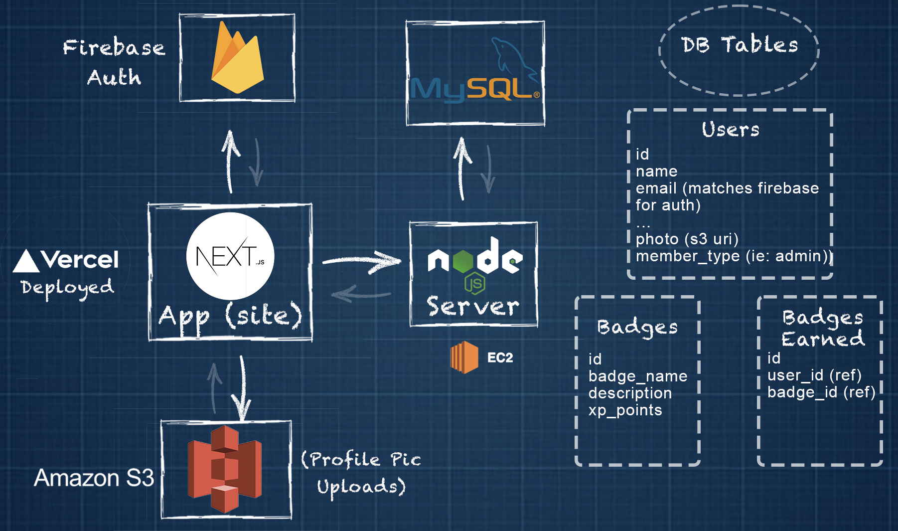

# Seattle Speakers Membership Site

#### Summary
A [Website](https://seattlespeakers.us) to host a club for men who want to improve their public speaking skills.
The design of this site was focused around gamify-ing self-improvement by providing badges to users for completing challenges.
A backend was created to store user credentials (such as profile picture, name, email) as well as these badges.
[Video Demo here](https://www.linkedin.com/feed/update/urn:li:activity:7033946055893282816/)

### Fully Responsive Design

### System Architecture

* Front-end Next.js app deployed on Vercel
* Backend deployed on EC2 instance with sql server installed for DB
* Firebase fetch for authentication
* S3 bucket for user image uploads (profile pic)

### Tech Stack

## Primary Challenge
* Registering users effectively on all Databases and Cloud services. Required a proper ordering the "domino effect" of async operations to successfully upload user credentials to firebase, s3, and MySQL.
* Keeping resource consumption down for image uploads
* Implementing image upload feature that allowed the user to crop their image.

##### Solution:
1. I first set up a server test route to confirm i'm getting a response so i can store user info. [ This was initially giving me trouble because if the server was down, the async function would upload the user's email & password to firebase but fail to send their info to the DB. This would prevent user from ever signing up with this email again as firebase would catch as a "user already exists" ]
2. The second order of business was to send credentials to firebase for authentication and password encryption. If that's successful, then...
3. Third was to upload the user's profile pic upload to S3 (because we need the returned URI to store in DB
4. Last was to store the user's form data (name, email, etc) into the MySQL db, including the returned S3 pic URI.
5. Finally, the user is grabbed from the DB (as the models-controllers construct default values the client didn't set), and is signed into app via firebase, and the page routes the community page—simulating a login.

##### Image Optimizations
I wanted to keep s3 storage down and, additionally, speed up the image crop feature I implemented. 
1. Images were immedietely optimized upon selection from user device (capped to 200kb) via a browser image optimizing function I used.
* this sped up image crop feature and prepared image for optimized upload to s3
2. In order to prevent old user images from taking up space, if a user updates their profile pic, code was written to trigger the deletion of the user's previous image from the S3 bucket. This reduced the storage space the required.

## Performance Optimization & Refactoring

* Image optimizations before S3 upload, along with image deletions of old images upon user updating their profile pic
* Client-side Rendering was refactored to use Next.js's Server-side rendering (SSR) and Static site generation (SSG). This reduced the HTTP requests drastically as all users are effectively "sharing" a server request for pages where data is shared (ie: community page).

### Database Design

The relational database consists of 3 tables:
* users 
* badges
* badges_earned

### Admin adding Badge to User profile (Demo)

Relationships between the badges and badges earned were made to reduce redundant db entries. The badges_earned table references the user_id and the badge_id.

### Deployment:

* Next.js app deployed to Vercel (with .env variables assigned)
* Node-Express backend deployed to AWS EC2 instance (w/ S3 bucket and using IAM user for access)

##### Notes
1. In order to run the Node server in the background (from ec2 ubuntu terminal via SSH connection), I ran the following command and exited the terminal:
 `node server.js > stdout.txt 2> stderr.txt &`

 
